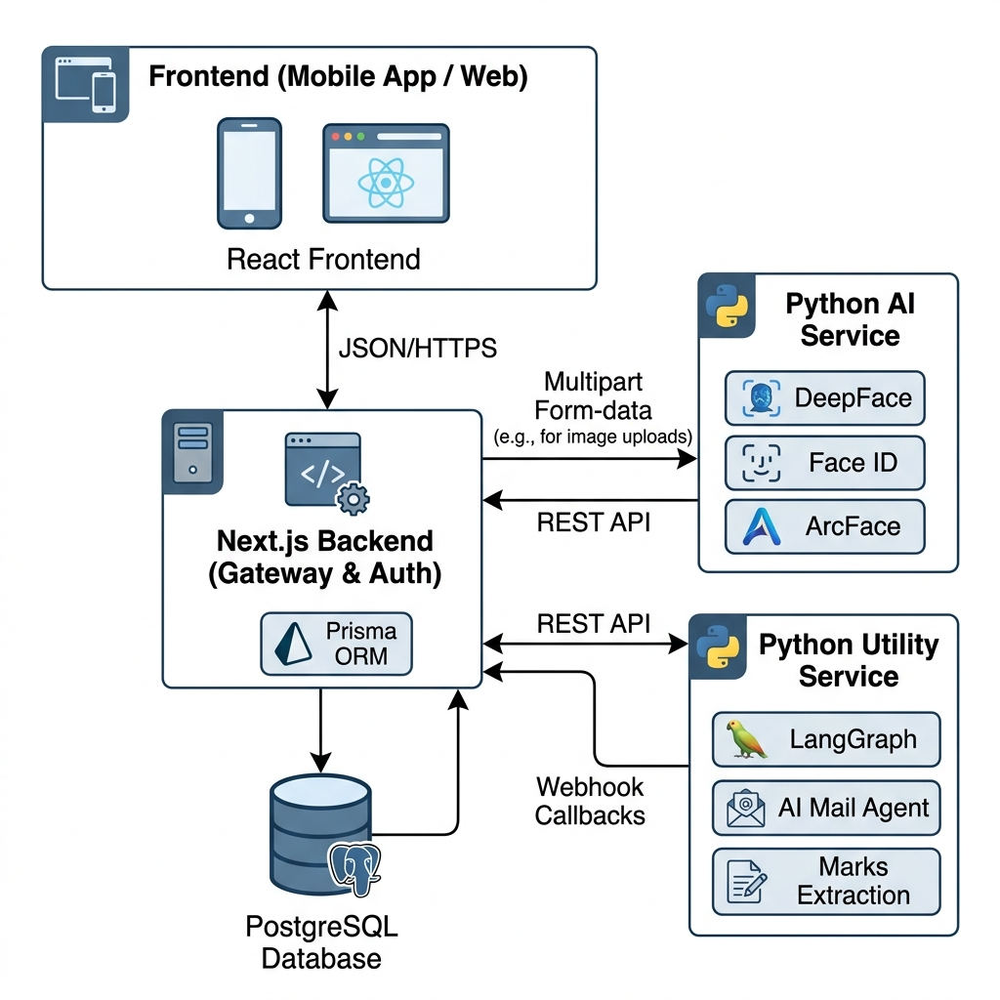
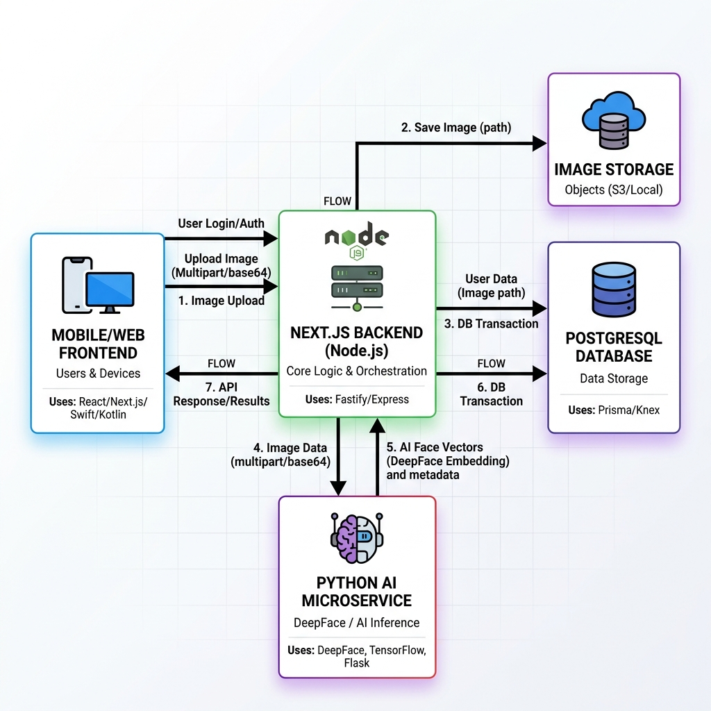

# 🏛️ AUTHORITY: The AI-Driven Campus Operating System

<div align="center">
  
  
  
  
  
</div>

---

## 🌟 Vision & Objective
**Authority** is a next-generation Educational Management System (EMS) engineered to eliminate the friction of campus administration. In an era where manual attendance and paperwork are bottlenecks, Authority introduces a **distributed neural architecture** that automates the core pillars of institutional life: **Attendance, Communication, and Performance Tracking.**

Our mission was to build a system that doesn't just store data, but *understands* it, using Computer Vision and Agentic AI to serve as a 24/7 digital administrator.

---

## 🏗️ System Architecture: The Triad Pattern
The project follows a **distributed microservice topology**, separating mission-critical business logic from high-intensity computational tasks.

### 1. The Core Orchestrator (`authority`)
The central gateway built with **Next.js 15**. It manages the primary relational database, user sessions, and orchestrates the flow of data between the AI compute nodes.

### 2. The Vision Intelligence (`authority_ai_service_backend`)
A specialized **FastAPI** node dedicated to spatial compute. It handles the high-performance face detection and biometric embedding pipeline.

### 3. The Agentic Utility (`authority_microservices`)
A utility layer powered by **LangGraph** and local LLMs. It handles intelligent communication (Mail Agent) and document processing (Marks Extraction).

### 🗺️ Technical Architecture Diagram


---

## 🛠️ Core Methodologies & Technical Techniques
As a backend-centric project, Authority implements several advanced engineering patterns to ensure it is robust, secure, and production-ready.

### ❄️ Distributed Unique Identifiers (Snowflake IDs)
We moved away from predictable auto-incrementing integers. Authority uses a **Snowflake-inspired 64-bit ID generator**. This ensures:
- **Horizontal Scalability**: IDs are unique across multiple database shards or microservices.
- **Security**: Prevents ID enumeration attacks by being non-predictable.
- **Time-Ordered**: Maintains natural chronological sorting of records.

### 🔗 Transactional Atomic Integrity
Complex operations (like multi-angle face enrollment or mass-attendance submission) are wrapped in **Prisma Transactions**. This ensures a "Success-or-Nothing" approach, preventing partial data corruption or orphaned records in the PostgreSQL database.

### 🤖 Agentic Mail Dispatch Logic
The **Mail Agent** isn't just a script; it's a **LangGraph-driven agent**.
- **Intent Recognition**: Uses **Gemma 3:4b** to understand natural language instructions.
- **Dynamic Retrieval**: Queries the Authority API to find relevant students/parents based on teacher instructions.
- **Autonomous Execution**: Generates personalized content and dispatches via Gmail OAuth2.

### 🎭 Biometric Pipeline: RetinaFace + ArcFace
Our face detection system doesn't just "see" a face; it mathematically encodes it.
- **Detection**: RetinaFace identifies faces even in poor lighting or angled shots (Left/Right).
- **Embedding**: ArcFace converts the face into a **512-dimensional vector**.
- **Normalization**: Ensures that Front, Left, and Right angles are processed to create a robust biometric profile.



---

## 🚀 Key Features
- **AI Face Attendance**: Automatic student identification from classroom group photos.
- **Intelligent Marks Extraction**: Upload a PDF or Excel of exam marks; our AI discovers the schema and maps it to the database automatically.
- **Natural Language Mailer**: A teacher can simply type *"Send attendance alerts to Section B students who missed more than 3 classes"* and the system handles the rest.
- **Syllabus & Topic Tracking**: Real-time monitoring of module coverage linked to specific class sessions.
- **Library Session Logging**: Automated entry/exit logging with state tracking (Active/Closed/Auto-closed).

---

## 💻 Tech Stack
- **Frontend/Gateway**: Next.js 15, TypeScript, Tailwind CSS, Zod.
- **Compute Backends**: Python 3.11, FastAPI, Pydantic, Uvicorn.
- **AI/ML Core**: DeepFace, RetinaFace, ArcFace, LangGraph, Ollama.
- **Database**: PostgreSQL, Prisma ORM.
- **Communication**: REST, Webhooks, Google OAuth2.

---

## ⚙️ Setup & Installation

### 1. Prerequisites
- **Node.js 18+** & **npm/pnpm**
- **Python 3.11+**
- **PostgreSQL** instance
- **Ollama** (for local LLM functionality)

### 2. Core Backend Setup (`authority`)
```bash
cd authority
npm install
# Configure your .env with DATABASE_URL, AUTH_SECRET, and Microservice URLs
npx prisma generate
npx prisma db push
npm run dev
```

### 3. AI Service Setup (`authority_ai_service_backend`)
```bash
cd authority_ai_service_backend/face-detection-pipeline
python -m venv venv
./venv/Scripts/activate # or source venv/bin/activate
pip install -r requirements.txt
python src/main.py
```

### 4. Utility Microservices Setup (`authority_microservices`)
```bash
cd authority_microservices
python -m venv venv
./venv/Scripts/activate
pip install -r requirements.txt
python main.py
```

---

## 📖 How to Use
1. **Enroll Students**: Go to the Student Profile and upload face samples (Front, Left, Right).
2. **Mark Attendance**: Teachers can upload a classroom photo; the AI Service will return detected students for verification.
3. **Upload Marks**: Use the "Job Submit" section to upload exam sheets; check the status for automated DB synchronization.
4. **AI Communication**: Use the Mail Agent dashboard to send instructions in natural language.

---

<div align="center">
  <p><b>Developed with 💻, ☕, and a passion for Robust Systems.</b></p>
</div>
